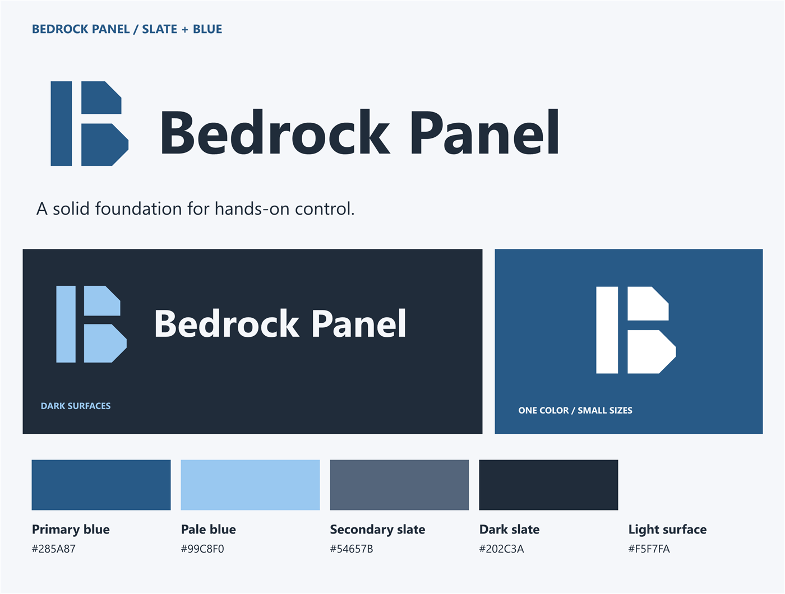
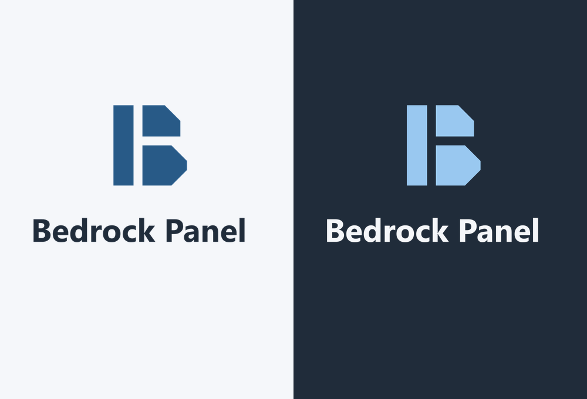
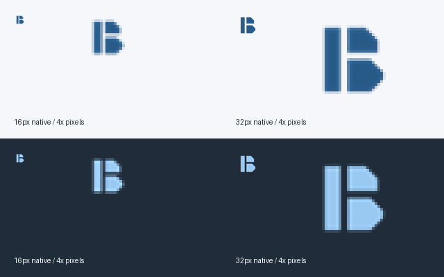

# Bedrock Panel brand kit — Slate + Blue

The approved identity: the original segmented B with Segoe UI Bold lettering, in Slate + Blue. This folder and `docs/bedrock-panel-branding.zip` are the consolidated handoff.



## Final asset suite

- `logo/primary/`: horizontal and stacked SVG/transparent PNG, 1000 px wide. Unsuffixed files are the light-mode version; `-dark` is for dark surfaces; `-reversed` is white artwork for primary-blue backgrounds.
- **Stacked means the original B above the single-line name “Bedrock Panel.”** The mark is unchanged.
- `logo/mark/`: original standalone mark in full color, black, white and reversed versions; transparent 16/32/256/512 px light/dark exports. Unsuffixed sized files use primary blue.
- `logo/monochrome/`: black and white horizontal/stacked lockups for one-ink use. White and reversed artwork are intentionally identical.
- `favicon/`: scalable SVG, multi-size ICO (16/32/48 px), Apple 180 px (both filename spellings), Android 192/512 px. Blue backgrounds with a white mark work across browser themes.
- `discord/`: 512 px icon and 960x540 banner, with SVG masters.
- `social/`: 1200x630 GitHub social preview in SVG/PNG.
- `colors.md`, `tokens.json`, `typography.md`, `lockup-metrics.json`: color roles, exact type specifications and lockup geometry.
- `contrast-report.json`, `asset-manifest.json`, `mark-size-review.png`, `favicon-size-review.png`: verification evidence.



## Logo use

Use **Bedrock Panel** in title case. Horizontal lockups suit headers and README banners; stacked lockups suit larger narrow spaces. Use the standalone mark for small Discord avatars and launcher icons where the full name would become too small.

Keep at least one stem width (18% of the mark's nominal square) of clear space around the visible artwork. Minimum full-lockup widths: horizontal 200 px, stacked 220 px. For print, start with 40 mm horizontal or 10 mm mark width and proof the actual material.

Do not stretch, rotate, change the blocks, add shadows, retype the logo using a fallback font, or place it over busy imagery. Use the light/dark variant appropriate to the background. Lettering is outlined in the SVG, so installed fonts are unnecessary for display.

## Tiny sizes



The original geometry is preserved. At 32 px the spine and lobes remain clearly separated. At 16 px the mark remains recognizable but its 1.28 px gaps and 2.88 px stem soften with antialiasing; it is not perfectly pixel-crisp. No alternate mark or pixel-fitted redesign is included. Open the review at 100% to judge native pixels. Physical print proofing and platform crop checks remain necessary for their respective uses.

## Voice and licensing

Clear, capable, welcoming. Lead with what people can do. Prefer “Connect your panel” to “Initialize HID transport.” Short copy: “Your panel. Your way.” Community copy: “Make your controls your own.”

Launcher/app code is MIT; reverse-engineered ARIS-68 protocol code is PolyForm Noncommercial 1.0.0. Do not describe every component as MIT or imply device-vendor affiliation.

## Rebuild and scope

```powershell
powershell -NoProfile -ExecutionPolicy Bypass -File tools/gen-bedrock-branding.ps1
python tools/finish-bedrock-branding.py
npm test
```

Windows with Segoe UI and Python with Pillow are required to regenerate assets. No font binaries are redistributed. The generator produces vector and raster assets from the same geometry; the finishing script writes the ICO, reviews, palette, contrast report, manifest and ZIP.

This is the branding asset handoff. Application titles, runtime UI colors, configuration paths, installer identity and executable icon have not been changed. The kit is under docs so it stays outside the existing Electron application package.
